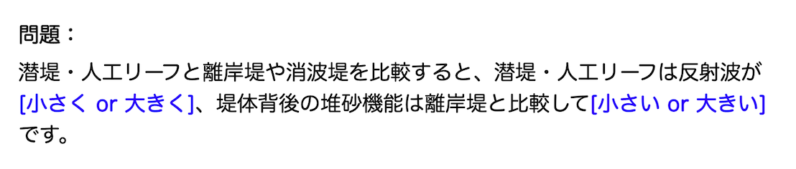
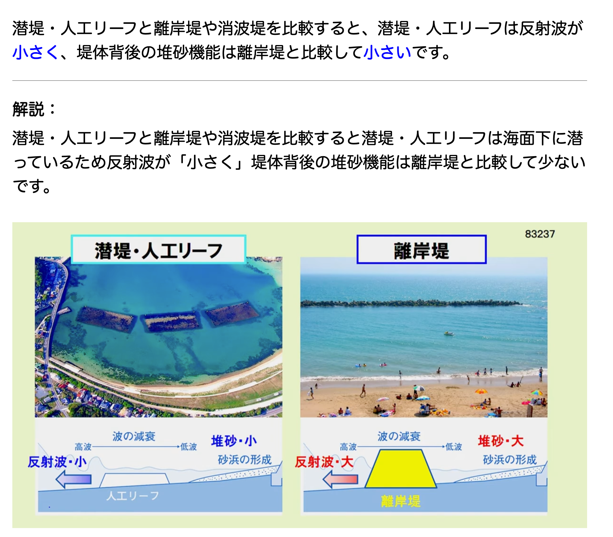

# 1級土木施工管理技士（一次試験）対策

## ankiを活用した勉強法
Ankiは、**忘却曲線に基づく「間隔反復」**という仕組みで効率的に暗記を助けるツールです。私はこのAnkiを使って、重要な用語や数字、法規などを繰り返し復習することで、知識を着実に定着させました。 

### Ankiの使い方

- [Anki公式サイト](https://apps.ankiweb.net/)  
- [ankiの使い方解説動画（おすすめ）](https://www.youtube.com/watch?v=IMyxvPyqCd8&vl=ja)  
- ankiを実際に使った感じ
穴埋め問題（問題）

穴埋め問題（答え）

### Ankiデッキの配布
私が作成したankiのデータを配布します。試験勉強に活用してください。
- [ankiデッキ:更新日2025/06/16](https://apps.ankiweb.net/)

## 参考にしたサイト
- [過去問.com](https://kakomonn.com/1dobokusekou)
- [絶対わかる土木施工管理の森](https://wakaru-civilengineering.com/)
- [スライドで学ぶ建設工学by雅（YouTube）](https://www.youtube.com/@doboku-YouTuber)
- [ひげごろー（YouTube）](https://youtube.com/playlist?list=PLhPdv7WWwtpu4MxBScxoE2paCM2zUdin3&si=uDMeUoY2wcarN1Dj)

