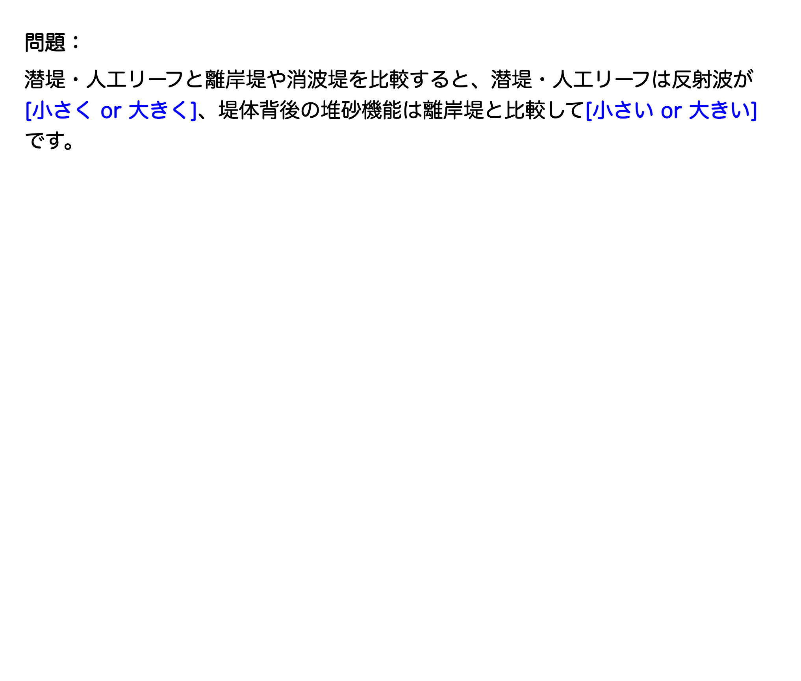

# 1級土木施工管理技士（一次試験）対策

## ankiを活用した勉強法
Ankiは、**忘却曲線に基づく「間隔反復」**という仕組みで効率的に暗記を助けるツールです。私はこのAnkiを使って、重要な用語や数字、法規などを繰り返し復習することで、知識を着実に定着させました。 

### Ankiの使い方

- [Anki公式サイト](https://apps.ankiweb.net/)  
- [ankiの使い方解説動画（おすすめ）](https://www.youtube.com/watch?v=IMyxvPyqCd8&vl=ja)  

### Ankiデッキの配布
私が作成したankiのデータを配布します。試験勉強に活用してください。
- [ankiデッキ](https://drive.google.com/file/d/1IxYxyvH6N_RCRyIkg_rJ8TYg2tvO1_dZ/view?usp=drive_link)
- 

## 参考にしたサイト

